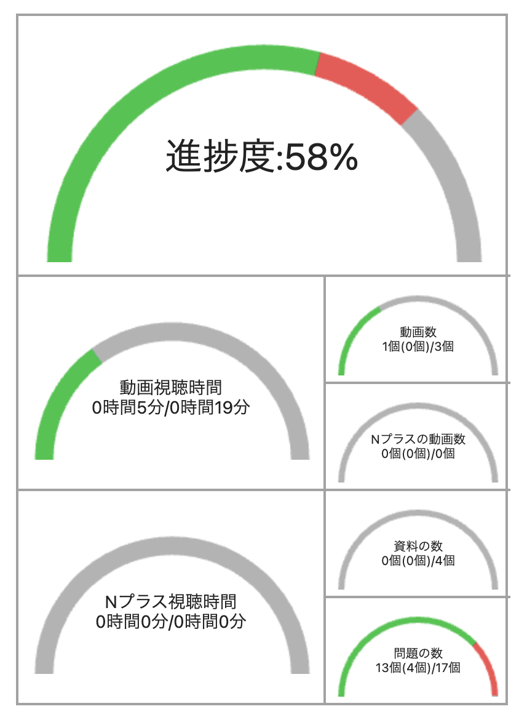

# ようこそ「N-time(えぬたいむ)」へ

### 最初に(ダウンロードしたらこれ読んだことになるからね)
＊N/S高等学校の教員に許可を取って公開しています。

これはN予備校の学習をサポートするものです。イヤホンやタッチペンのように学習をサポートするものであり、皆さんがレポートが提出できなくても「イヤホンが悪かったからできなかった！」とかいっても意味がないですよね。
それとこの拡張機能は同じです。何かがあっても私は責任を持ちません。
「あと何分しか動画ないから大丈夫」「あと何問だけだから風呂食ってくる」とかギリギリになって提出しないで余裕をもってやりましょう。

私は言いましたから、絶対に「終わらなかったのですが!?」とかクレームを入れてこないでね！

最後に、色んな人に後押ししてもらい、無事やる気が消えることがなくここまでできました。
N/S高生、教職員の皆様改めてありがとうございます。引き続きご支援のほどお願い致します。

### 概要・機能紹介
このN-timeはN予備校の動画数や問題数のみやすさを改善するために11月後半という皆が終わり始めてたタイミングで
制作を開始しました(気づくのが遅かった)。

### この拡張機能でわかりやすくなること

・動画の数、見た動画数、動画時間、視聴済み時間
・Nプラスの数、見た動画数、動画時間、視聴済み時間
・資料？(課外授業によくある紙マークのやつ)の数、自身がある物と無い物の数
・問題の数や正答した数と不正解の数
以上が可視化され、わかりやすくなります。

### インストール方法
ダウンロードリンクに記載

[最新のダウンロードリンク](https://github.com/kurimogo/n-time/releases/tag/V1.0.0)

### 使い方
インストールができたら放置で問題なし！試しにN予備校を開いて、各教科の右側にある概要・授業を見てみよう
たくさん情報が増えたらおめでとう。増えなかったら友達に聞くか下の取扱説明書を見てね！
